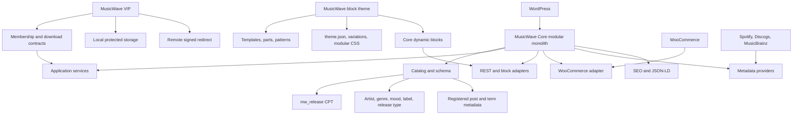
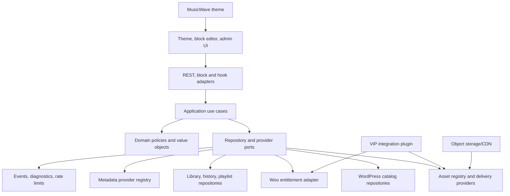
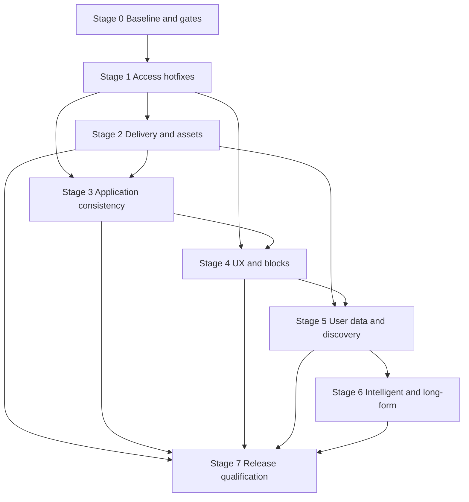

# MusicWave Upgrade Plan

> **Status:** Phase 1 architecture and planning complete — implementation not started  
> **Plan version:** 1.0.0  
> **Created:** 2026-08-19  
> **Scope:** `music-wave-core`, `music-wave-vip`, `musicwave`, development tooling, tests, documentation, packaging, and release operations

## 1. Plan authority and change control

This document is the **single source of truth** for the MusicWave upgrade. It supersedes implementation status and future-work claims in `MusicWave-Backlog.md`, `DEVELOPMENT.md`, and topic-specific documents when they conflict with the inspected code or this plan. Existing ADRs and technical documents remain useful evidence and operating detail, but this plan controls priority, dependencies, acceptance criteria, and release readiness.

During implementation:

1. Every major change must map to a work item and acceptance criterion in this document.
2. Update the status tables here in the same change that completes a work item.
3. Record material architectural decisions as ADRs and link them from this plan.
4. Do not mark an item complete based only on static inspection. Record the command, environment, and result used to verify it.
5. Security and data-integrity blockers may not be deferred to post-release without an explicit risk acceptance decision.
6. Preserve working behavior unless this plan explicitly replaces it; use migrations, feature flags, compatibility shims, and deprecation periods where required.

### Status vocabulary

- **Not started:** no implementation work accepted.
- **In progress:** implementation exists but acceptance criteria have not all passed.
- **Blocked:** an external decision or dependency prevents progress.
- **Complete:** code, tests, documentation, migration, and compatibility checks all pass.
- **Deferred:** deliberately removed from the target release with rationale recorded here.

---

## 2. Executive assessment

MusicWave is a commercial WordPress music catalog and commerce platform, not merely a theme. It currently consists of:

- a modular Core plugin that owns release data, metadata lookup, catalog discovery, access decisions, WooCommerce mappings, libraries, playback queues, secure-delivery orchestration, blocks, and SEO;
- a VIP integration plugin that supplies membership adapters and local or remote protected-file delivery;
- a block theme that supplies full-site-editing templates, patterns, visual styles, sliders, shelves, account surfaces, and player presentation.

The core product direction is sound: `mw_release` is independent from WooCommerce products, discovery uses taxonomies, sensitive fields are private, and integrations are contract-driven. The repository also has meaningful schema migrations, dynamic blocks, dependency-free smoke tests, Playwright scaffolding, design tokens, Media Session support, and deny-by-default access logic.

It is **not production-ready**. The highest risks are concrete defects in the current code:

- restricted release bodies can be exposed through public WordPress REST responses;
- the default “protected” directory can still be inside the real web document root on subdirectory installations;
- one-time replay records accumulate indefinitely in `wp_options`;
- release editors can assign guessed protected asset identifiers without provider-side authorization;
- personal-library and JSON-LD paths can disclose unpublished releases;
- persistent navigation replaces the entire page body without safely reconciling WordPress/WooCommerce lifecycle state or accessibility;
- dashboard content disappears when JavaScript fails;
- account and access surfaces are duplicated;
- analytics writes and several block registrations violate intended boundaries or duplicate schemas;
- JavaScript, VIP static analysis, real WordPress/Woo integration tests, accessibility, RTL, performance, package installation, and security attack cases are not enforced in CI;
- licensing is contradictory (`proprietary` in Composer versus GPL declarations elsewhere) and no `LICENSE` or third-party notice inventory exists.

The recommended approach is **targeted evolution of the current modular monolith**, not a rewrite. Keep WordPress-native catalog data, stabilize confidentiality and consistency first, create explicit application services and policy boundaries, then introduce indexed custom tables only for high-cardinality operational data such as asset inventory, token replay, playback history, and advanced user libraries.

---

## 3. Project goal and product boundaries

### 3.1 Goal

Deliver a secure, accessible, scalable, internationalized WordPress music platform for labels, artists, publishers, podcast networks, and music stores that can:

- publish a rich catalog independently of any commerce plugin;
- sell or grant access to releases through WooCommerce and replaceable membership providers;
- provide public previews and authorized downloads/streams without exposing protected masters;
- support editorial discovery, artist pages, collections, credits, podcasts, and user libraries;
- remain manageable through Gutenberg/Site Editor and standard WordPress administration;
- package the theme, Core, and VIP integration as independently versioned, installable products.

### 3.2 Non-goals for the production baseline

- Replicating a global streaming service or its branding.
- Building DRM, native mobile applications, social feeds, or collaborative playlists before rights, moderation, privacy, and operating-cost models exist.
- Moving canonical catalog content out of WordPress.
- Replacing WooCommerce checkout/order management.
- Introducing microservices merely for architectural fashion.
- Storing protected master files in public media URLs.

### 3.3 Target users

- **Visitor:** discovers artists and releases and listens to permitted previews.
- **Customer/member:** purchases, saves, downloads, streams, and resumes entitled content.
- **Editor/artist manager:** authors catalog metadata and relationships without gaining infrastructure-level asset access.
- **Store manager:** maps commercial offers and understands entitlement readiness.
- **Administrator/operator:** configures providers, storage, privacy, diagnostics, and release health.
- **Extension developer:** integrates membership, storage/CDN, metadata, analytics, or presentation without bypassing core policies.

---

## 4. Current architecture verified from code

### 4.1 Repository and versions

| Package | Current version | Responsibility | Runtime dependencies |
|---|---:|---|---|
| `music-wave-core` | `0.9.0` | Domain model, application services, WordPress adapters, REST, blocks, playback, library, Woo integration, metadata, SEO | WordPress 6.6+; WooCommerce optional |
| `music-wave-vip` | `0.3.3` | Membership adapters, protected asset management, local delivery, remote signed redirects | Core required; provider configuration |
| `musicwave` | `0.5.0` | Block theme, templates, patterns, styles, presentation blocks, slider and theme preference | Core strongly expected; Woo optional |
| Root tooling | `0.9.0` in `package.json` | PHP/JS quality, tests, packaging, POT generation | PHP 7.4 declared; Node 20+; Composer/npm dev packages |

Core and the theme declare WordPress 6.6+, PHP 7.4+, and testing through WordPress 6.8. `composer.lock` uses WordPress stubs newer than that claim, so the compatibility statement is not currently proven by CI.

### 4.2 Runtime composition

`music-wave-core/src/Plugin.php` is the composition root. It constructs shared schema, repository, access, download, metadata, library, and SEO services and registers module wrappers through `ModuleRegistry`. Null providers make optional integrations fail closed. This is a good foundation and should remain.

### 4.3 Data model

- `mw_release` is the canonical entity for tracks, singles, EPs, albums, mixes, playlists, podcast shows, and podcast episodes.
- `mw_artist`, `mw_genre`, `mw_mood`, `mw_label`, and `mw_release_type` are WordPress taxonomies.
- `mw_collection_items` models ordered album/podcast/playlist children; `_mw_collection_ids` is a private reverse index.
- Public descriptive metadata is registered for REST. Product IDs, membership levels, provider data, and download assets are private.
- WooCommerce products are commercial offers linked through `mw_product_ids`; `_mw_release_ids` is the product-side reverse index.
- Personal library items are stored in a bounded serialized user-meta structure.
- Download replay state is stored as one option per consumed token.
- VIP local assets are filesystem paths represented by `local:` provider identifiers.

### 4.4 Current modules and capabilities

| Area | Implemented behavior |
|---|---|
| Catalog | CPT/taxonomies, archive filtering/sorting, release defaults, artist metadata, collection validation |
| Authoring | Schema-driven metabox, product mapping, protected quality assignment, readiness checks, metadata lookup |
| Access | Public, purchase, membership, purchase-or-membership, and restricted modes; manual/membership contracts |
| Commerce | Woo product mapping, purchase ownership checks, account library endpoint/panels |
| Playback | Public preview queue, entitled quality selection, global player, Media Session integration |
| Downloads | Signed user/release/quality/purpose claims, current-entitlement recheck, one-time download replay control, streaming route |
| Library | Saved releases/artists, REST mutation, dynamic blocks |
| Metadata | Spotify, Discogs, MusicBrainz search/enrichment, taxonomy mapping, remote cover import |
| SEO | Release metadata fallbacks, common SEO-plugin detection, MusicRecording/MusicAlbum/Podcast JSON-LD |
| Theme | Block templates, patterns, style variations, dark/light/system preference, shelves, sliders, catalog/account/product layouts |
| VIP | Role/filter membership, protected upload/import/listing, local PHP streaming, remote signed redirects |
| Quality | Dependency-free PHP smoke tests, template integrity checks, PHP lint scripts, PHPCS/PHPStan configs, Playwright editor tests, package/POT tools |

### 4.5 Strengths to preserve

1. Plugin-owned data and business logic with theme-owned presentation as the intended boundary.
2. WordPress-native catalog identity independent of WooCommerce.
3. Taxonomy-based discovery instead of broad meta-query filtering.
4. Canonical metadata definitions and deny-by-default access modes.
5. Provider contracts and null implementations for optional integrations.
6. HMAC claim integrity, purpose separation, current entitlement recheck, and local path canonicalization.
7. Server-rendered dynamic blocks and standard Block Theme templates.
8. Media Session, reduced-motion handling, progressive-enhancement catalog forms, and semantic SEO output.
9. Versioned migrations and readiness/diagnostic concepts.
10. No required production Composer package or compiled front-end runtime.

---

## 5. Problems and technical debt

Severity definitions: **P0** blocks a safe release; **P1** is required for maintainability/reliability; **P2** improves scalability and product quality; **P3** is a later capability.

### 5.1 Security and privacy

| Priority | Problem and evidence | Required outcome |
|---|---|---|
| P0 | `ReleasePostType` exposes `mw_release` in REST, while `ReleaseBlocks::filter_content()` deliberately skips gating during REST. Protected body/excerpt data can be returned by `/wp/v2/mw_release`. | Apply one shared release-visibility/access projection to item, collection, search, embed, and block REST representations; denied callers receive only explicitly public teaser fields. |
| P0 | `ProtectedAssetStorage` validates roots against `ABSPATH`, not the actual document root. A subdirectory WordPress install can place the default directory inside the public web root. | Require a demonstrably private root, fail closed when it cannot be proven, and add operational reachability/site-health checks. |
| P0 | `TransientReplayStore` creates permanent `wp_options` rows. Expired rows are not generally collected, and issuance/delivery has no rate limit. | Use an atomic expiring replay store with cleanup and quotas; emit `429` and privacy-safe metrics under abuse. |
| P0 | `DownloadAssetRoutes` allows anyone who can edit a release to assign arbitrary opaque asset IDs, while VIP asset listing has a stronger but broad `upload_files` check. | Introduce dedicated asset capabilities, provider-side reference validation, asset ownership/tenant scope, and opaque registry IDs. |
| P0 | `LibraryRepository::target_exists()` checks post type but not publish/read status; `LibraryCatalog` can return draft/private release metadata. | Enforce publish/read policy on both write and read, including stale entries. |
| P0 | `ReleaseJsonLd::tracks()` does not require child releases to be published/readable. | Use the same public-release policy for SEO graph members. |
| P1 | Signed token and nonce values are carried in query strings and can enter logs/history. Remote redirected URLs become transferable bearer URLs until expiry. | Exchange short opaque tickets; redact logs; define remote replay/revocation semantics. |
| P1 | Remote redirect signatures omit `mode`, have no target-host allowlist, and accept weak secrets. | Version and sign the complete canonical payload, enforce allowed hosts and strong rotatable keys, support environment/constant secrets. |
| P1 | Core provider credentials and VIP secrets are stored in plain options; no secret-source abstraction or rotation exists. `discogs_secret` is configured but unused. | Add environment/constant override, masked UI, non-autoloaded storage, validation, key IDs/rotation, and remove ineffective settings. |
| P1 | Protected upload checks are extension-based rather than MIME/content based; ZIP risk is not bounded. | Validate actual file type/size, quarantine optional archives, verify copied bytes, and never execute protected files. |
| P1 | Sensitive routes lack user/IP/release/concurrency limits. Asset listing recursively scans storage per request. | Add layered rate limits, quotas, pagination, concurrency controls, and audit events. |
| P1 | Role/filter membership sources are not isolated: the external filter defaults to WordPress roles. | Define grant/deny/veto semantics and test every source combination. |
| P1 | Personal library and future history data lack WordPress privacy exporters/erasers and documented retention. | Add exporter/eraser callbacks, consent/retention settings, and data inventory. |
| P1 | Audit hooks have no versioned event schema, correlation ID, retention, or redaction policy. | Publish privacy-safe event contracts and operational guidance. |

### 5.2 Architecture and data integrity

| Priority | Problem | Required outcome |
|---|---|---|
| P0 | Collection REST creation cannot fully validate before insert; after-insert rollback can silently discard submitted relations while returning success. | Return structured REST errors and never report a discarded mutation as success. |
| P0 | Collection and product reverse-index updates are multi-step and unchecked but described as atomic. Partial failures can leave indexes inconsistent. | Treat reverse indexes as rebuildable derived data; check writes, record failures, and provide idempotent reconciliation. |
| P1 | Metadata apply writes post fields, taxonomies, metadata, and artwork through separate direct operations instead of one application service/repository boundary. | Introduce a metadata application use case with typed result, validation, controlled partial-success policy, and rollback/repair behavior. |
| P1 | Provider errors and rate limits are swallowed as “no results,” making outages and bad credentials invisible. | Distinguish no-results, misconfiguration, rate limit, remote failure, and internal failure; expose safe diagnostics. |
| P1 | Cover import has no explicit download/byte/pixel budget before processing. | Enforce HTTP timeout, redirect, host, byte, MIME, dimension, and processing budgets. |
| P1 | Migrations run only during `admin_init` for `manage_options`; long or failed migrations have no lock, resume state, CLI path, or network strategy. | Add locks, resumable batches, CLI/admin orchestration, failure state, multisite policy, and preflight/backup guidance. |
| P1 | `Plugin::boot()` is a growing manual composition root; module extension filters can throw and break all boot. | Keep it as composition root but introduce focused factories/provider registries, deterministic ordering, and safe extension error handling. |
| P1 | Block attributes are duplicated across `block.json`, `Rendering::editor_blocks()`, localized PHP, and JavaScript; the editor unregisters/re-registers hydrated blocks and can drop future metadata. | Make full `block.json` metadata authoritative and attach editor behavior without replacing registered settings. |
| P1 | Theme slider/shelf blocks use PHP/JS-localized duplicate schemas instead of `block.json`. | Convert presentation blocks to standard metadata registration. |
| P1 | Theme increments `mw_views`, violating the business-logic boundary and creating race-prone writes on page views. | Move analytics to optional Core/integration events; batch or externalize aggregation. |
| P1 | Settings, module contracts, REST responses, filters, and actions are not versioned as a public extension API. | Publish compatibility policy, typed payload schemas, deprecation process, and namespaced API evolution. |
| P2 | One serialized user-meta library is capped and not queryable; entitlement discovery scans up to 100 releases. | Keep user meta only for the basic tier; migrate high-volume library/history/follows to indexed tables with cursor pagination. |
| P2 | No canonical asset registry exists; filesystem-relative names serve as identifiers. | Add an asset table with opaque IDs, provider, owner, checksum, metadata, state, and lifecycle timestamps. |

### 5.3 UX, accessibility, and internationalization

| Priority | Problem | Required outcome |
|---|---|---|
| P0 | `preview-player.js` intercepts broad same-origin navigation, fetches HTML, and replaces `<body>` without reliable script/style hydration, teardown, focus, announcements, `<html lang/dir>`, Woo lifecycle, or plugin compatibility. | Default to native navigation. If persistent playback remains, scope it to verified routes behind a setting/feature flag and implement complete lifecycle/fallback behavior. |
| P0 | Account dashboard panels are all initially `hidden`; without JavaScript, no dashboard content is usable. | Render the initial panel visible and enhance progressively. |
| P0 | Account page intentionally renders dashboard, separate library, and Woo My Account surfaces together. | Establish one canonical account router/shell with clear saved, entitled, purchased, downloads, orders, and profile sections. |
| P0 | Restricted release template can display gates from content filtering, metadata, and access panel simultaneously. | Render one canonical gate/CTA; other blocks return public-safe information or nothing. |
| P1 | Catalog AJAX replaces the first global `.wp-block-query`; browse filters do not clearly control the visible shelf; live announcements are unstable. | Pair each form to a stable result region with `aria-controls`, persistent status, abortable requests, native fallback, and correct history. |
| P1 | Library “items per page” is only a hard limit. Removal errors use alerts and counts can become stale. | Add real cursor/page navigation, inline status/error messages, normalized counts, and empty states. |
| P1 | Queue supports traversal but not reorder, remove, play-next, clear, shuffle, repeat, or durable state; its disclosure lacks complete focus behavior. | Build an accessible, keyboard-operable queue model and explicit disclosure/dialog behavior. |
| P1 | Slider uses fragile LTR forcing and raw `scrollLeft` under RTL; autoplay lacks an explicit pause; dots are undersized. | Normalize logical scrolling, use Previous/Next semantics, provide pause/play and 44px targets, and label slides/viewport. |
| P1 | Hard-coded English remains in templates/patterns, POT generation ignores HTML and `block.json`, and scripts do not call `wp_set_script_translations()`. | Make all shipped copy translatable, generate complete POTs, set script translations, and enforce catalog freshness. |
| P1 | RTL support is partial: physical left/right properties, transforms, and player/slider direction assumptions remain. | Use logical properties and direction-aware behavior; perform Persian/Arabic mixed-content QA. |
| P1 | Tokens and component CSS drift (`--mw-color-muted`, hard-coded accent fallbacks, duplicated player selectors); style variations are not fully exercised. | Define semantic token ownership, lint undefined variables, consolidate component CSS, and test all variations. |
| P1 | Several interaction defects exist: a styled anchor without `href`, non-actionable browse cards, a missing `#latest` target, generic search under music-specific copy, inconsistent no-results states. | Correct semantics, links, labels, route scope, and empty/error behavior. |
| P1 | Woo product pages do not prominently connect mapped release previews/metadata/access expectations. | Add a safe mapped-release product block while leaving checkout/order handling native to Woo. |
| P2 | Theme documentation/tests retain a nonexistent sidebar architecture and dead rules. | Explicitly restore or remove it; the recommendation is removal unless product requirements justify it. |

### 5.4 Performance and scalability

1. All theme component CSS and slider/theme scripts load on every page; player assets are broadly global.
2. Local streaming runs through PHP workers and supports repeated range requests, which does not scale for large FLAC/ZIP traffic.
3. Protected asset inventory is a recursive O(N) filesystem scan for each page/search.
4. Account entitlement discovery scans releases and can perform repeated Woo ownership checks.
5. Artist counts fetch matching IDs instead of count-only results.
6. Related-release scoring and random ordering can become expensive on large catalogs.
7. Page-view post-meta writes defeat caching and race under concurrency.
8. No query-count, memory, response-time, Core Web Vitals, concurrent stream, or large-catalog budget is automated.
9. Cache invalidation rules are implicit rather than owned by services.
10. Public REST and HTML cache semantics are not explicitly separated from user-specific entitlement responses.

### 5.5 Quality, compatibility, documentation, and release operations

1. CI runs only PHP 7.4 and 8.2 jobs and does not install/run Node checks or Playwright.
2. There is no `package-lock.json`, so reproducible `npm ci` is unavailable.
3. `tools/check-js.php` reports success when JS dependencies are absent; this is unsuitable for release CI.
4. Composer’s manual PHP syntax list omits newer Core and VIP classes.
5. PHPCS omits VIP and excludes broad areas; PHPStan omits VIP/tools and remains at level 3.
6. Template checker failure does not reliably produce a nonzero process status and is not a CI gate.
7. Smoke tests mock WordPress functions; they do not prove REST, database, hooks, Woo order transitions, or filesystem delivery in real WordPress.
8. Playwright covers block insertion mainly on plain pages and one Chromium desktop viewport.
9. No minimum/current WordPress and WooCommerce matrix, multisite, object-cache, web-server, CDN, or packaged-artifact installation tests exist.
10. No automated Composer/npm audit, CodeQL/SAST, secret scan, Theme Check, Plugin Check, accessibility scan, visual regression, or performance budget.
11. Root `README.md` is effectively empty; several documents describe old versions or completed work as future work.
12. Core, VIP, and theme versions are independent but there is no release manifest or compatibility matrix.
13. Licensing is contradictory and no `LICENSE`, notices, asset inventory, or provenance report exists.
14. Packaging does not require quality gates, verify version parity, test extracted archives, or install packaged artifacts.
15. PHP 7.4 is end-of-life. Continuing to advertise it as a production baseline is a security and maintenance risk.

### 5.6 Validation performed during Phase 1

Using explicit XAMPP PHP 8.2.12 because PHP was not resolvable through the shell PATH:

- `php tests/run.php` — passed: `MusicWave domain smoke tests passed.`
- `php tools/check-templates.php` — passed: `ALL TEMPLATES OK`.
- `node --check` on representative critical JS (`preview-player.js`, Core block editor JS, theme slider, theme preference) — passed.

Not independently rerun in this workspace:

- Composer validation, recursive PHP syntax, PHPCS, and PHPStan, because PHP was absent from the shell PATH and `vendor/` is empty.
- ESLint and Playwright, because `node_modules/` is absent.
- WordPress/WooCommerce/VIP staging, browser, accessibility, RTL, security, and performance tests.

These unavailable checks remain required roadmap work and must not be interpreted as passing.

---

## 6. Recommended target architecture

### 6.1 Architectural style

Use a **modular WordPress monolith with explicit domain, application, and infrastructure boundaries**. Do not rewrite the product into a framework or separate service. Introduce external services only behind provider contracts when storage/CDN/search/analytics scale requires them.

### 6.2 Required layers and ownership

#### Domain

Pure or minimally WordPress-coupled objects for:

- release visibility and publication policy;
- access/entitlement decisions with reason, source, and optional expiry;
- asset reference/quality validation;
- collection relationship rules;
- token/ticket claims and purpose;
- playlist/queue/history rules;
- provider result/error types.

#### Application

Use-case services that orchestrate repositories/providers and return structured results:

- `PublishRelease` / release readiness validation;
- `ApplyMetadataToRelease`;
- `ReplaceCollectionItems`;
- `MapProductsToRelease`;
- `ResolveEntitlement`;
- `IssueDeliveryTicket` / `DeliverAsset`;
- `SaveLibraryItem` / `ListLibrary`;
- later `RecordPlaybackProgress`, `ManagePlaylist`, and `FollowArtist`.

Application services own transaction/repair behavior, cache invalidation, audit events, and errors. WordPress callbacks remain thin.

#### Infrastructure

- WordPress CPT/taxonomy/meta repositories.
- Custom tables only for operational/high-cardinality data.
- REST controllers with explicit schemas and permission callbacks.
- WooCommerce adapter and lifecycle hooks.
- Metadata HTTP clients/providers.
- VIP storage/CDN adapters.
- Cron/Action Scheduler jobs, WP-CLI commands, rate limiters, and diagnostics.

#### Presentation

- Theme owns layout, templates, patterns, style variations, and visual block styles.
- Core owns reusable domain-aware blocks and their server rendering.
- VIP owns configuration UI for its providers, not catalog presentation.
- Theme never mutates catalog, entitlement, analytics, library, or asset data.

### 6.3 Persistence strategy

Continue using WordPress storage where it fits:

- `mw_release`, post content, descriptive metadata, taxonomies, artist term metadata, and Woo product mappings remain WordPress-native.
- Treat `_mw_collection_ids` and `_mw_release_ids` as derived indexes that can be rebuilt.
- Do not create separate CPTs for every release type unless distinct lifecycle/permissions prove necessary.

Add dedicated tables after schema/upgrade design for:

1. **Asset registry:** opaque asset ID, provider, owner/tenant, storage key, checksum, MIME, bytes, state, timestamps, metadata, and soft-delete/orphan status.
2. **Delivery replay/tickets:** hashed ticket ID, purpose, user, release/asset, expiry, consumed timestamp, with unique/indexed expiry and scheduled cleanup; allow Redis atomic storage as an adapter.
3. **User activity:** playback history/progress and, when volume requires it, library/follows with user/entity/time indexes.
4. **Playlists:** playlist identity/privacy plus ordered item table, avoiding serialized arrays.

Use `dbDelta` only with carefully tested schemas, resumable migrations, and explicit indexes. Provide uninstall/data-retention choices; never delete customer catalog or order data by default.

### 6.4 Public visibility and entitlement model

Create one shared `ReleaseVisibilityPolicy` used by:

- WordPress REST preparation;
- library read/write;
- JSON-LD;
- collections and related releases;
- playback queues;
- search/catalog projections;
- blocks and feeds.

Separate concepts:

- **Discoverability:** whether title/artwork/public teaser may appear.
- **Content access:** whether body/extended editorial content may render.
- **Playback access:** preview versus full quality.
- **Download access:** whether a ticket may be issued now.
- **Asset assignment:** whether an editor may reference an asset.

Return an `EntitlementDecision` with `allowed`, `reason`, `source`, `effective_until`, and safe CTA metadata. Do not reduce all decisions to a boolean.

### 6.5 Delivery architecture

- Browser receives a short opaque same-origin ticket, never a provider path or reusable signed claim.
- Core authorizes current user, release, purpose, and quality immediately before resolving a provider.
- Replay/ticket stores are atomic, bounded, and expiring.
- VIP validates that the requested asset is registered and assignable to the release/owner.
- Small sites may use local delivery through `X-Accel-Redirect` or `X-Sendfile`; PHP streaming is an explicitly limited fallback.
- Scaled sites use private S3/R2-compatible storage or a CDN with provider-native short-lived signed URLs/cookies.
- Remote signatures include version, storage key/opaque ID, expiry, purpose, release, and unique ticket; target hosts are allowlisted.
- Downloads and streams have separate TTL, replay, range, concurrency, and revocation rules.

### 6.6 Dependency and version policy

- Preserve current PHP 7.4-compatible syntax while stabilizing the release branch, but create an ADR for the supported runtime.
- Recommended production target for the next major release: **PHP 8.2+**, with CI on 8.2 and currently supported PHP versions. If marketplace requirements force a PHP 7.4 install baseline, label it legacy compatibility and do not imply upstream security support.
- Test WordPress minimum supported, current stable, and next/beta smoke where practical.
- Test WooCommerce absent, minimum supported, and current stable.
- Keep zero production Composer dependencies unless a dependency clearly reduces security risk and can be packaged/audited reliably.
- Commit npm lock data for development tools; shipped runtime JS remains dependency-light and does not require client framework hydration.

---

## 7. Theme, plugin, module, and API integration strategy

### 7.1 Theme contract

The theme must work without fatal errors when Core or WooCommerce is absent. Where domain blocks are unavailable, render an administrator-facing setup notice in the editor and a safe public fallback. It may style Woo and Core blocks but may not reimplement access or commerce decisions.

- `theme.json` is the authority for global tokens and supported editor controls.
- Component CSS consumes semantic variables; no untracked brand-color fallbacks.
- Block-specific assets load through metadata or conditional enqueueing.
- Style variations must provide all semantic palette roles and pass contrast tests.
- Presentation blocks receive `block.json`, editor script/style metadata, and server rendering only when translation or dynamic behavior requires it.

### 7.2 Core module contract

- Module registration remains interface-based but gains stable module IDs, explicit dependency ordering, and safe failure diagnostics.
- New modules must declare hooks/routes/assets and must not depend on theme classes.
- Optional modules (history, recommendations, playlists) are setting/feature-flag controlled and can be disabled without data loss.
- Shared services are injected; avoid global static bindings except narrow WordPress interoperability shims with deprecation plans.

### 7.3 VIP/provider strategy

Replace implicit filter-only contracts with documented interfaces and versioned capabilities:

- `MembershipProvider`: resolve levels and entitlement with source/expiry.
- `AssetProvider`: validate assignment, inspect metadata, deliver/redirect, report health, and declare features.
- `ReplayStore` / `TicketStore`: atomic issue/consume/expire.
- `RateLimiter`: scope and retry information.
- Optional `AnalyticsSink` and `SearchProvider` interfaces.

Provider configuration must declare required capabilities, secret source, health, and data-sharing implications. Core validates interface compatibility and continues with a null provider only where fail-closed behavior is safe.

### 7.4 REST/API strategy

- Keep `music-wave/v1` backward compatible while fixing confidentiality defects.
- Publish request/response schemas and error codes; add `_links` where useful.
- Add a future `v2` only for incompatible representation changes.
- Use controller-specific permission checks, object-level capabilities, rate limits, and `context` handling.
- Never expose private provider identifiers, order evidence, membership keys, tokens, filesystem paths, secrets, or unpublished relationships.
- Use cursor pagination for high-cardinality endpoints.
- Cache only public projections; user-specific responses use private/no-store semantics.
- Add integration hooks at application-service boundaries rather than allowing filters to override foundational deny decisions.

### 7.5 WooCommerce strategy

- Woo remains optional; the catalog works when it is inactive.
- Define entitlement policy for processing/completed/custom statuses, full and partial refunds, chargebacks, cancellations, guest linking, deleted users, product remapping, subscriptions, bundles, and variations.
- Add a Woo adapter returning reasoned decisions and lifecycle events.
- Keep checkout, order management, taxes, and payment behavior native to Woo.
- Integrate mapped release preview/public metadata through a dedicated block, not template-specific queries.

### 7.6 Metadata providers

- Providers are registered in a capability/priority registry.
- Store normalized external IDs separately by provider.
- Report provider health and explicit error categories without leaking credentials or full user queries.
- Add request timeouts, retry/backoff, caching, quotas, identifiable/privacy-reviewed User-Agent policy, and cover-import budgets.
- Metadata application is a previewable, auditable application use case; editors choose which fields to overwrite.

---

## 8. Required fixes and refactoring workstreams

### A. Confidentiality and access boundary

- Gate REST release content and all indirect projections.
- Introduce shared visibility/entitlement decisions.
- Fix unpublished library/JSON-LD/collection leakage.
- Ensure one canonical front-end gate.
- Add attack-path regression tests before other feature work.

### B. Protected asset and delivery hardening

- Private-root validation and migration guidance.
- Dedicated asset capabilities and registry.
- Opaque ticket exchange, expiring replay store, rate limits, key rotation.
- Full remote signature/host validation.
- MIME/size/archive validation.
- X-Accel/X-Sendfile and object-storage/CDN adapters.

### C. Consistent application services

- Metadata application service.
- Collection relation service and reverse-index reconciler.
- Product mapping and entitlement service.
- Structured results/errors and privacy-safe event DTOs.
- Resumable migrations and CLI operations.

### D. Block/editor modernization

- Full `block.json` authority for Core and theme blocks.
- Stop unregistering/re-registering hydrated blocks.
- Set script translations.
- Searchable entity controls instead of raw IDs/slugs.
- Editor/front-end parity tests in real release contexts.

### E. Theme and account UX correction

- Native navigation by default; safely scoped persistent player only after compatibility proof.
- Progressive-enhancement account shell and consolidated information architecture.
- Explicit catalog result targets and real library pagination.
- Accessible queue/slider/player behavior.
- Complete translation, RTL, token, empty-state, and Woo product integration work.

### F. Performance and operations

- Conditional assets and public/private cache policy.
- Remove synchronous view writes.
- Count-only/cached relationship queries and curated pools instead of large `RAND()` queries.
- Indexed assets, tickets, and user activity.
- Query/performance budgets, health metrics, cleanup jobs, and operator runbooks.

### G. Release engineering

- Resolve licensing and provenance.
- Release manifest and version compatibility enforcement.
- Complete CI matrices and reproducible Node install.
- Real WordPress/Woo integration, E2E, accessibility, RTL, security, and package-install tests.
- Correct stale docs and generate complete translations.

---

## 9. Missing and new features

Features are ordered by fit with a commerce/catalog platform, not by imitation of Spotify or Apple Music.

### 9.1 Production-baseline product features

1. **Unified account hub:** overview, saved library, purchases/entitlements, downloads, follows, orders, and profile in one accessible router.
2. **Real catalog search:** catalog-only scope, type facets, artist/release/genre autocomplete, useful no-results and recent-query behavior.
3. **Editable playback queue:** play next, add/remove, reorder, clear, shuffle, repeat, durable session state.
4. **Release/artist follow and wishlist/pre-save:** useful for stores and labels even when continuous streaming is not offered.
5. **Mapped product experience:** preview and public release metadata adjacent to Woo offer details.
6. **Operator asset library:** searchable, paginated, ownership-aware, checksum-backed assets with orphan and usage status.
7. **Entitlement/audit explanation:** safe administrative answer to “why can/can’t this user access this release?”
8. **Onboarding:** environment checks, provider setup, demo import, readiness checklist, and safe rollback.

### 9.2 Post-stability capabilities inspired by leading music platforms

#### Continue listening and history

Especially valuable for podcasts, mixes, audiobooks, DJ sets, and long albums. Store per-user position, completed state, last played time, and device/session conflict rules. Make history optional, exportable, erasable, and retention-controlled.

#### User playlists and collections

Support private/public playlists, ordered items, add-from-card/player, duplicate handling, and share links. Collaborative editing is later and requires permissions, moderation, conflict resolution, and abuse controls.

#### Explainable recommendations

Use follows, saved items, purchases, explicitly consented history, genre/mood/artist relationships, and editorial curation. Show explanations such as “Because you follow…” rather than opaque profiling. Start with cached rules; do not build machine learning until data volume and privacy basis justify it.

#### Follow notifications

On-site and opt-in email alerts for new releases, pre-orders, podcast episodes, or updated downloads. Provide frequency and channel preferences and avoid unsolicited marketing coupling.

#### Podcast/long-form listening

Playback speed, skip intervals, chapters, transcripts, episode completion, series follow, and resume. Transcripts must be searchable and keyboard/screen-reader friendly.

#### Rich credits and contributor discovery

Structured roles, contributor pages, liner notes, label/publisher information, and relationship navigation. This differentiates MusicWave from generic Woo stores and builds on existing `mw_credits`.

#### Sharing and deep links

Release/track links, playlist links, and optional timestamp sharing for podcasts/mixes. Never embed protected ticket data in shared URLs.

#### Lyrics and media extras

Only with verified rights/licensing. Support synchronized or plain lyrics, videos, booklets, and artwork galleries through provider-aware public/protected assets.

### 9.3 Deliberately deferred capabilities

- Offline/PWA protected playback until rights, revocation, storage quota, service-worker upgrades, and device security are designed.
- Social activity feeds until moderation, privacy, blocking/reporting, and operational staffing exist.
- Collaborative playlists until access control and conflict handling are robust.
- Audio fingerprinting, loudness normalization, transcoding, and waveform generation until asynchronous media infrastructure and cost controls exist.
- Native apps, casting ecosystems, or car integrations until stable APIs and a business case exist.

---

## 10. Security, performance, scalability, and WordPress best practices

### 10.1 Mandatory security controls

- Deny by default at every protected boundary.
- Object-level capability checks, not broad `edit_posts`/`upload_files`, for release and asset actions.
- Nonces protect browser intent but never replace authorization.
- Validate and normalize input at REST/admin boundaries; escape for the exact output context.
- Do not expose private identifiers in REST, HTML, logs, analytics, schema, or URLs.
- Use strong random opaque IDs and constant-time signature comparison.
- Rotate secrets and derive purpose-specific keys; allow environment/secret-manager configuration.
- Rate-limit issuance, failed delivery, streams, asset operations, metadata requests, and user mutations.
- Validate redirect hosts and all behavior-affecting signed fields.
- Maintain dependency, vulnerability, secret, and provenance scans.
- Define incident response, revocation, log retention, and support-bundle redaction procedures.

### 10.2 WordPress practices

- Register post/taxonomy/meta on `init`; use stable capabilities and activation/deactivation only for lifecycle operations.
- Keep callbacks thin and use official WP/Woo APIs.
- Use REST argument schemas and `permission_callback` for every route.
- Use Settings API with non-autoloaded secrets and masked fields.
- Use Action Scheduler or WP-Cron only for bounded resumable work; expose WP-CLI alternatives.
- Add personal-data exporters/erasers and privacy-policy suggestions.
- Support object cache and multisite explicitly or declare unsupported configurations.
- Avoid request-time rewrite flushes, broad global queries, and synchronous analytics writes.
- Treat uninstall as data-preserving by default with an explicit opt-in cleanup setting.
- Use Plugin Check, Theme Check, WPCS, PHPCompatibility, and WordPress accessibility guidance.

### 10.3 Performance budgets

Release acceptance on representative seeded data should target:

- Lighthouse mobile: Performance ≥ 90, Accessibility ≥ 95, Best Practices ≥ 95, SEO ≥ 95.
- p75 field targets: LCP ≤ 2.5s, INP ≤ 200ms, CLS ≤ 0.1.
- No catalog/account query growth proportional to total catalog size for one page of results.
- No recursive full asset scan in an HTTP request.
- No unbounded option/user-meta growth.
- Public archive/single responses are full-page-cache compatible when user-specific controls are absent.
- User-specific REST/account responses are private and bounded.
- Download/stream concurrency is tested against documented deployment limits.
- JS/CSS per route has a recorded budget and block-specific loading.

Exact query, memory, and asset-byte budgets must be baselined in Phase 2 after a representative dataset is generated, then recorded here rather than guessed.

### 10.4 Scalability model

| Scale | Recommended deployment |
|---|---|
| Small catalog / low download volume | WordPress DB, object cache optional, private local files, X-Accel/X-Sendfile preferred |
| Medium catalog / memberships | Persistent object cache, indexed asset/ticket/activity tables, Action Scheduler, CDN/object storage signed delivery |
| Large catalog / high traffic | Managed DB/read strategy, Redis atomic ticket/rate limits, object storage/CDN, external search adapter, asynchronous analytics/media processing |

The same domain/application interfaces must support all three; deployment-specific behavior belongs in infrastructure providers.

---

## 11. Testing and compatibility strategy

### 11.1 Test pyramid

1. **Domain/unit:** policies, claims, validators, value objects, result/error types, recommendation rules.
2. **WordPress integration:** real database, registered routes/meta, capabilities, migrations, privacy callbacks, REST projections, cron/CLI.
3. **Woo/VIP integration:** real orders/refunds/statuses, product remapping, local/remote asset providers, range requests, replay, rate limits.
4. **Block/editor E2E:** actual release contexts, every access state, save/reload, Site Editor, theme variations.
5. **User E2E:** catalog, player, queue, account, purchase/download, no-JS, errors, mobile, RTL.
6. **Non-functional:** accessibility, visual regression, security attack cases, query/load/performance, packaged install/upgrade.

### 11.2 Required compatibility matrix

- PHP: supported baseline plus every currently supported target version.
- WordPress: declared minimum, current stable, and next-version smoke.
- WooCommerce: absent, declared minimum, current stable.
- Browser: current/previous Chromium, Firefox, WebKit/Safari; mobile viewport/touch.
- Direction/language: English LTR and Persian or Arabic RTL with mixed Latin metadata.
- Server delivery: Apache/Nginx behavior, local acceleration, and at least one object-storage/CDN provider.
- Cache: no persistent object cache and Redis/Memcached adapter.
- WordPress modes: single site; multisite must either pass a defined matrix or be explicitly unsupported before release.

### 11.3 Mandatory security regression cases

- Anonymous/unauthorized REST release item, collection, search, embed, and JSON-LD access.
- Draft/private release enumeration through library, collection, related, playback, and SEO paths.
- Token/ticket tamper, expiry, replay, account transfer, purpose confusion, quality substitution, and entitlement revocation.
- Query/log leakage and referrer behavior.
- Storage root inside document root; path traversal, symlink escape, guessed asset assignment, cross-owner access.
- MIME spoof, oversized upload, ZIP bomb policy, malformed/multi-range requests.
- Remote mode tamper, host redirect, weak/rotated key, expired URL.
- Rate limit and cleanup behavior.
- Woo refund/cancel/chargeback/partial-refund/custom-status and guest-linking policy.

### 11.4 CI and release gates

- Commit Composer and npm lockfiles; use `composer install` and `npm ci` reproducibly.
- Recursive PHP syntax discovery rather than a manual file list.
- PHPCS/PHPCompatibility and increasing PHPStan strictness over Core, VIP, theme PHP, tests, and release tools.
- ESLint on all shipped JS; add CSS/style and undefined-token checks.
- Composer/npm audit, CodeQL or equivalent SAST, and secret scanning.
- POT regeneration/freshness, `msgfmt --check`, and script translation checks.
- Plugin Check and Theme Check.
- Real WordPress integration jobs and Playwright browser projects.
- Axe automation plus documented manual keyboard/screen-reader/RTL sign-off.
- Package, extract, checksum, forbidden-file/secret scan, clean install, activate, upgrade, and smoke test the actual ZIPs.

No release can rely on a check that silently skips because tooling is absent.

---

## 12. Prioritized implementation phases and dependencies

The user-requested **Phase 2** will execute the following implementation stages incrementally. Each stage must preserve working behavior, inspect dependencies before major changes, update this plan, and pass its exit gate before dependent work begins.

### Stage 0 — Baseline, decisions, and reproducible quality gates

**Priority:** P0  
**Dependencies:** explicit approval to begin Phase 2  
**Status:** In progress — local gates complete and passing; awaiting first GitHub CI run and Docker-based wp-env boot verification

**Evidence (2026-08-19, Windows, PHP 8.2.12 XAMPP, Node 24, Composer 2):**

1. Baseline commit `65b5832` captured all pre-Phase-2 user changes before any modification.
2. `release-manifest.json` added (Core 0.9.0 / schema 0.8.0, VIP 0.3.3, theme 0.5.0, compatibility ranges).
3. Licensing resolved: root `composer.json` `proprietary` → `GPL-2.0-or-later` (matching all shipped readme headers), verbatim GPL-2.0 `LICENSE` added, `docs/third-party-notices.md` records the provenance audit (no bundled third-party runtime code found).
4. `docs/adr/0003-runtime-support-policy.md` accepted: PHP 7.4 floor for the current line, PHP 8.2+/WP 6.7+ at next major, WooCommerce 9.x optional.
5. `package-lock.json` generated; CI JavaScript job uses `npm ci` + `npm run lint:js` and cannot silently skip. All committed JS passes `node --check`.
6. `composer check:syntax` replaced with recursive `tools/check-syntax.php` — 136 PHP files pass (the old hand list covered ~110). `music-wave-vip` added to `check:phpcs` and `phpstan.neon`; `phpcs` = 0 errors across all three packages (`ignore_warnings_on_exit` gates errors only; 9 advisory VIP warnings are Stage 2 scope); `phpstan` level 3 = 0 errors; `composer test` passes; `composer validate --strict` passes.
7. `.wp-env.json` fixture added (WP 6.8, PHP 8.2, both plugins + theme; Woo installable on demand) plus a CI `wordpress-fixture` smoke job (activation + front-page fatal check). Local Docker boot not yet verified.
8. `DEVELOPMENT.md` onboarding corrected (stale 0.7.0 claim, gate list, fixture instructions, licensing/versioning pointers).

**Remaining for exit gate:** green run of `.github/workflows/quality.yml` on GitHub (PHP 7.4 + 8.2 matrix, JS, fixture jobs) from a clean checkout.

Deliverables:

1. Protect current user changes; capture baseline status and test evidence.
2. Add a release manifest for Core/VIP/theme/schema and compatibility ranges.
3. Resolve licensing model and add `LICENSE`, notices, and asset/dependency provenance.
4. Decide PHP/WordPress/Woo support policy through ADR; recommended next-major baseline PHP 8.2+.
5. Add npm lockfile and non-skipping JS CI.
6. Make recursive syntax, template, PHPCS, PHPStan, JS, and package checks reliable and inclusive.
7. Create a reproducible local/CI WordPress fixture with Woo optional.
8. Correct root onboarding documentation enough for contributors to run gates.

Exit gate:

- Existing behavior tests are reproducible from a clean checkout.
- All packages are covered by syntax/static/lint checks.
- Licensing and version compatibility are unambiguous.
- A failed or unavailable required gate fails CI.

### Stage 1 — Confidentiality and authorization hotfixes

**Priority:** P0  
**Dependencies:** Stage 0 test fixture  
**Status:** In progress

**Evidence (2026-08-19):** PHPStan surfaced four wiring defects in `Plugin.php` — `ReleaseVisibility` and `ReleaseRestVisibilityPolicy` were constructed but the receiving classes ignored them, so none of the intended gating ran. Completed in this increment, each with regression tests in `tests/run.php` (`composer test` green):

- Deliverable 1 (shared visibility policy): `LibraryRepository`, `LibraryCatalog`, and `ReleaseJsonLd` now consume `ReleaseVisibility` (deny-by-default construction when not injected).
- Deliverable 2 (REST gating, partial): `ReleaseRestVisibilityPolicy` is now registered by the `Rendering` module; regression tests prove restricted bodies/excerpts are redacted for denied actors and preserved for allowed ones. Embed/search contexts still need real-WordPress integration tests.
- Deliverable 3 (library + JSON-LD unpublished fixes): unprivileged actors can no longer store or list unpublished releases in personal libraries; collection JSON-LD track lists and parent-series lookups exclude non-public children (tests cover draft-release denial, privileged read-capability allowance, summary hiding, and track-list exclusion).

**Remaining:** collection REST mutation errors (deliverable 4), dedicated asset capabilities (5), canonical access gate in release presentation (6), and running the security suite against a real WordPress fixture (7).

Deliverables:

1. Shared release visibility policy.
2. REST content/excerpt/embed/search gating.
3. Library and JSON-LD unpublished-release fixes.
4. Collection REST mutation errors instead of silent discard.
5. Dedicated asset capabilities and assignment validation stopgap.
6. One canonical access gate in release presentation.
7. Security regression suite for every repaired path.

Exit gate:

- No protected content or unpublished metadata is observable through tested public/low-privilege paths.
- Editors cannot assign assets they are not authorized to manage.
- Failed relation mutations return actionable errors and preserve data.

### Stage 2 — Secure delivery and asset foundation

**Priority:** P0/P1  
**Dependencies:** Stages 0–1  
**Status:** Not started

Deliverables:

1. Private-root preflight and safe migration guidance; remove unsafe automatic guarantee.
2. Opaque asset registry and provider assignment contract.
3. Atomic expiring ticket/replay store with cleanup.
4. Rate limits, quotas, concurrency policy, and structured audit events.
5. Opaque browser tickets; remote complete-payload signing, host allowlist, strong key/rotation support.
6. MIME/size/checksum validation and archive policy.
7. X-Accel/X-Sendfile support and object-storage/CDN provider interface.
8. Delivery threat-model and load tests.

Exit gate:

- Direct web access, path/ID guessing, replay, tampering, cross-user transfer, and unsafe redirect cases fail closed.
- Replay and asset metadata are bounded/indexed and cleanable.
- Deployment limits and supported provider modes are documented and measured.

### Stage 3 — Application boundaries and data consistency

**Priority:** P1  
**Dependencies:** Shared policies and provider contracts from Stages 1–2  
**Status:** Not started

Deliverables:

1. Reasoned entitlement service and explicit Woo lifecycle policy.
2. Metadata application service with preview/overwrite choices and bounded cover import.
3. Collection/product mapping services with checked writes and derived-index reconciliation.
4. Provider registry, health/error taxonomy, safe observability.
5. Resumable/locked migrations, WP-CLI support, multisite decision.
6. Privacy exporter/eraser and retention settings.
7. Versioned extension/event contracts and deprecation policy.

Exit gate:

- No application path performs uncoordinated direct metadata writes where consistency is required.
- Derived indexes can be audited and rebuilt.
- Real Woo order transition tests prove documented decisions.
- Failed providers/migrations produce safe actionable diagnostics.

### Stage 4 — Block, theme, account, and accessibility correction

**Priority:** P0/P1  
**Dependencies:** Stable application APIs from Stage 3; urgent no-JS/navigation fixes may begin after Stage 1  
**Status:** In progress — urgent no-JS and duplicate-surface fixes only (permitted early per the dependency note)

**Evidence (2026-08-19):**

- Account dashboard no longer server-hides every panel: markup renders all panels expanded, and `dashboard.js` collapses them on load, so content survives JavaScript failure (deliverable 2, partial; §14 item 4). Template-integrity tests now assert the no-JS contract.
- Duplicate account/gate surfaces removed from the `account-hub` theme pattern: the standalone `music-wave/music-library` block and the `[woocommerce_my_account]` shortcode (which produced a second sign-in gate for logged-out visitors) are gone; the dashboard block already provides library, orders, account, and membership panels with a single guest gate.
- Remaining deliverables (navigation, block.json authority, conditional assets, a11y/RTL, translations) untouched — they depend on Stage 3.

Deliverables:

1. Native navigation default; persistent player feature safely scoped or deferred.
2. One progressively enhanced account shell.
3. `block.json` authority for Core and theme blocks; no destructive re-registration.
4. Conditional route/block assets.
5. Correct catalog targeting, browse behavior, and library pagination.
6. Accessible queue, slider, player, focus, route announcements, and no-JS behavior.
7. Complete translation/POT/script translations and RTL logical-layout conversion.
8. Token cleanup, style-variation contrast, semantic interaction fixes, mapped-release Woo block.
9. Remove or formally restore stale sidebar architecture.

Exit gate:

- Key visitor/customer/editor tasks work with keyboard, screen reader checks, mobile, RTL, and JavaScript failure fallback.
- Woo routes do not break under player/navigation behavior.
- Editor and frontend schemas/styles remain in parity.
- Assets are conditionally loaded and performance budgets pass.

### Stage 5 — Scalable library, playback, and discovery

**Priority:** P2  
**Dependencies:** Stages 2–4  
**Status:** Not started

Deliverables:

1. Indexed user activity storage with migration/retention.
2. Editable durable queue, shuffle/repeat/play-next.
3. Listening progress, recently played, and continue listening with consent.
4. User playlists with ordering/privacy/share rules.
5. Artist follows and wishlist/pre-save.
6. Catalog autocomplete/facets and external search adapter boundary if native search benchmarks fail.
7. Query/cache optimization and large-dataset tests.

Exit gate:

- User features remain paginated and indexed at target dataset sizes.
- Privacy controls, export, erasure, and retention pass.
- Discovery does not expose protected/private data or require unbounded queries.

### Stage 6 — Intelligent editorial and long-form capabilities

**Priority:** P2/P3  
**Dependencies:** Stable user activity/discovery from Stage 5  
**Status:** Not started

Deliverables:

1. Explainable recommendations combining editorial rules with consented signals.
2. Follow notifications and preferences.
3. Podcast speed, chapters, transcripts, completion, and series follow.
4. Rich contributor/credit pages.
5. Safe deep links and timestamp sharing.
6. Licensed lyrics/media extras only after rights decision.

Exit gate:

- Recommendations are explainable, privacy reviewed, opt-out capable, and measurable.
- Notification consent/unsubscribe and accessibility requirements pass.
- Long-form state synchronizes reliably without harming normal music playback.

### Stage 7 — Production release qualification

**Priority:** P0  
**Dependencies:** All stages included in the chosen release scope  
**Status:** Not started

Deliverables:

1. Full compatibility matrix and upgrade tests from every supported prior version.
2. Security review of final routes, providers, secrets, and artifacts.
3. Accessibility, RTL, SEO/schema, privacy, and performance sign-off.
4. Load/concurrency tests for catalog, account, ticketing, and delivery.
5. Versioned, reproducible archives; extracted checksum and forbidden-file verification.
6. Clean install/activation/upgrade tests using packaged ZIPs.
7. Updated installation, operations, migration, backup/rollback, incident, and release notes.
8. Final comparison against every in-scope item in this document.

Exit gate:

- No unresolved P0/P1 defect in release scope.
- Every supported environment has recorded evidence.
- Rollback and data recovery are documented and tested.
- Legal/licensing, privacy, accessibility, and marketplace checks are complete.

### Dependency summary

A production baseline may enter Stage 7 after Stage 4 if Stages 5–6 are explicitly designated post-release. Stages 0–4 are not optional for a secure marketplace release.

---

## 13. Definition of done for every implementation item

An item is complete only when all applicable conditions are met:

- Root cause is fixed at the correct package/layer.
- Backward compatibility and migration impact are understood and tested.
- Unit/integration/E2E/security tests cover success, denial, failure, and edge cases.
- Input, output, capability, nonce, privacy, and logging implications are reviewed.
- Query/asset/performance impact is measured where behavior is user-facing or high-volume.
- Accessibility, translation, RTL, no-JS, and responsive behavior are checked where UI changes.
- Public APIs/hooks/settings are documented and versioned.
- Operator/editor/user documentation is updated.
- Package versions and schema migration are updated when required.
- Relevant CI gates pass from a clean dependency install.
- `PROJECT_PLAN.md` status and evidence are updated.

---

## 14. Immediate implementation order after approval

The first implementation increment should be intentionally small and high-value:

1. Establish reproducible baseline gates without changing runtime behavior.
2. Add failing integration/security tests for protected REST content, unpublished library/JSON-LD data, and unauthorized asset assignment.
3. Implement the shared visibility policy and repair those leaks.
4. Make the account dashboard initial panel visible without JavaScript and remove duplicate gate output.
5. Re-run focused tests, then the full available suite.
6. Update this plan with evidence before beginning protected-storage/ticket redesign.

Do not begin playlists, recommendations, visual redesign, or large storage migrations before the P0 confidentiality and release-gate work passes.
